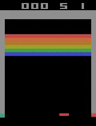

Here we aim to get a [gym environment](https://github.com/openai/gym) running an interact with it.


# TLDR

We get a OpenAI gym reinforcement learning environment to visualize what is happening and train a model to play the game ATARI breakout.


# [1.1_gym.py](./1.1_gym.py)
This is the simplest algo - just taking a random step. We visualize it using env.render()

In order to reproduce you need to
- install OpenAI's gym<br>

<code>pip install gym pygame gym[atari]</code><br>

- install the ATARI Breakout Rom<br>

<code>ale-import-roms /folder_with_rom/</code><br>

We see that it never reaches "done". This we will fix.


# [1.2_wrapper.py](./1.2_wrapper.py)
We add a wrapper that makes sure we reach done=True if we drop the ball. For this we need to install stable-baselines3.
The [EpisodicLifeEnv](https://stable-baselines3.readthedocs.io/en/master/_modules/stable_baselines3/common/atari_wrappers.html#EpisodicLifeEnv) wrapper does this for us.

<code>pip install stable-baselines3 stable-baselines3[extra]</code>


# [1.3_train.py](./1.2_wrapper.py)
Let's do better than random steps. Let's train a model. For that we need to setup our system. The following are suggestions based on how I do things.<br>

## Conda Environments
I did it using [anaconda](https://www.anaconda.com/). After installing anaconda create a new environment:

```
conda create --name gym -y
conda activate gym
```

From now on whenever we do something on the command line, assure you are in this conda environment. Packages you install inside a environment using conda or pip are only available when you are in the environment.<br>

## GPU
Go to [pyTorch](https://pytorch.org/get-started/locally/) and do the necessary to get your pytorch running with either your CPU or GPU. For me it was <br>
<code>conda install pytorch torchvision torchaudio cudatoolkit=11.3 -c pytorch -y</code><br>

## Findings
So let's run 1.3_train.py and train the model. The output shows us if it uses our GPU (cuda). Also it tells us some wrappers that have been automatically applied.<br>
```
Using cuda device
Wrapping the env with a `Monitor` wrapper
Wrapping the env in a DummyVecEnv.
Wrapping the env in a VecTransposeImage.
```
<br>
To optimize our model training process we will later test some more wrappers.

```
----------------------------------------
| rollout/                |            |
|    ep_len_mean          | 58.2       |
|    ep_rew_mean          | 0.42       |
| time/                   |            |
|    fps                  | 359        |
|    iterations           | 5          |
|    time_elapsed         | 28         |
|    total_timesteps      | 10240      |
| train/                  |            |
|    approx_kl            | 0.09496141 |
|    clip_fraction        | 0.584      |
|    clip_range           | 0.2        |
|    entropy_loss         | -1.27      |
|    explained_variance   | 0.536      |
|    learning_rate        | 0.0003     |
|    loss                 | -0.115     |
|    n_updates            | 40         |
|    policy_gradient_loss | -0.105     |
|    value_loss           | 0.0103     |
----------------------------------------
```
<br>
This shows us some metrics during the training process. We can also explore them via a nice UI with tensorboard.

## tensorboard
```conda install -c conda-forge tensorboard```
I install it not from the main conda channel, but from conda-forge (the -c parameter). In order to start it:<br>
- make sure you are in the correct conda environment and in the folder in which you started<br>

The code want to write into '~/models/breakout-v4/tb_log/', so make sure the folder exists. Then start tensorboard.<br>
```
mkdir -R ~/models/breakout-v4/tb_log/
tensorboard --logdir ~/models/breakout-v4/tb_log/
```
Now you can open [tensorboard](http://localhost:6006/) in your browser. Here you will see progress on our model.

Whenever you train a new model with the tensorboard_log parameter you will see the training process (almost) live in tensorboard. We are mostly intereset in rollout/ep_rew_mean, as this shows the average score per episode (until the ball is dropped).

## results
ep_rew_mean as well as the video show us that our model performs poorly. But we have setup all we need to get started - now we can focus on improving the model.



