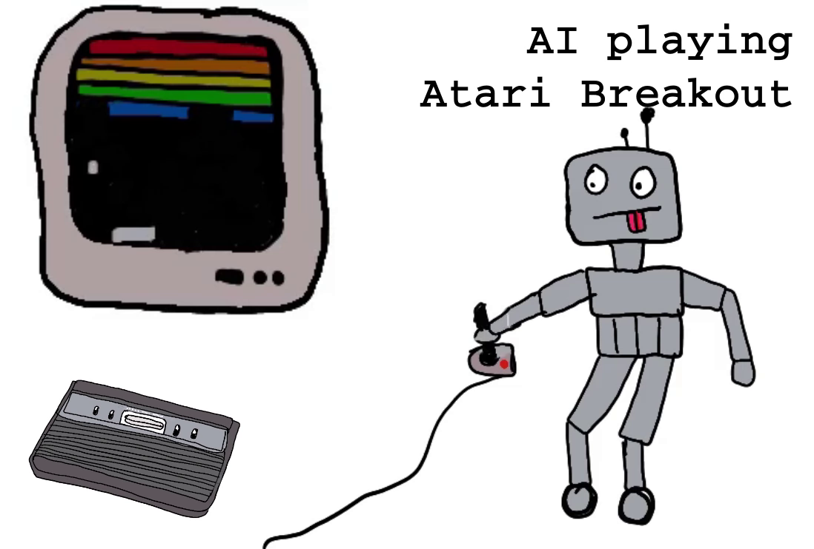

**Goal**: Basic interaction with a [gym environment](https://github.com/openai/gym).

**Prerequisities**: Make sure you have [setup your system](../_setup) the necessary tools.

**Train RL model to play Breakout - Howto 1/5** Video link - click on the picture.
[](https://youtu.be/DqzSCpKE-zk)


# [1.1_gym.py](./1.1_gym.py)
This is a simple algorithm - just take a random step and render the image and repeat. This shows the turn based approach. The step hands back the observation, a reward (if we hit a brick) and a done flag. We see that the game doesn't reach "done", when the ball is dropped. This we fix with a wrapper.


# [1.2_wrapper.py](./1.2_wrapper.py)
Wrappers can be seen as extensions and modifications to the environment. We add a wrapper that makes sure we reach done=True if we drop the ball. For this we need to install stable-baselines3.
The [EpisodicLifeEnv](https://stable-baselines3.readthedocs.io/en/master/_modules/stable_baselines3/common/atari_wrappers.html#EpisodicLifeEnv) wrapper does this for us. It is a Atari specific wrapper. 

[Later](../3_obswrapper) we will implement a custom wrapper that allows us simplify the way the model *sees* the environment, by removing colour and triming the picture. And we will add an aimbot - like a HUD for the model telling it where the ball will cut the panel' pane.

# [1.3_train.py](./1.2_wrapper.py)
Let's do better than random steps, by running 1.3_train.py and training a model. The output shows us if it uses our GPU (cuda). Also it tells us some wrappers that have been automatically applied.<br>
```
Using cuda device
Wrapping the env with a `Monitor` wrapper
Wrapping the env in a DummyVecEnv.
Wrapping the env in a VecTransposeImage.
```
<br>
To optimize our model training process we will later test some more wrappers.

```
----------------------------------------
| rollout/                |            |
|    ep_len_mean          | 58.2       |
|    ep_rew_mean          | 0.42       |
| time/                   |            |
|    fps                  | 359        |
|    iterations           | 5          |
|    time_elapsed         | 28         |
|    total_timesteps      | 10240      |
| train/                  |            |
|    approx_kl            | 0.09496141 |
|    clip_fraction        | 0.584      |
|    clip_range           | 0.2        |
|    entropy_loss         | -1.27      |
|    explained_variance   | 0.536      |
|    learning_rate        | 0.0003     |
|    loss                 | -0.115     |
|    n_updates            | 40         |
|    policy_gradient_loss | -0.105     |
|    value_loss           | 0.0103     |
----------------------------------------
```
<br>
This shows us some metrics during the training process. We can also explore them via a nice UI with tensorboard.

The code writes the tensorboard logs into '~/models/breakout-v4/tb_log/', so make sure the folder exists (or adjust the folder). Then start tensorboard.<br>
```
mkdir -p ~/models/breakout-v4/tb_log/
tensorboard --logdir ~/models/breakout-v4/tb_log/
```
Now you can open [tensorboard](http://localhost:6006/) in your browser. Here you will see progress on our model.

Whenever you train a new model with the tensorboard_log parameter you will see the training process (almost) live in tensorboard. We are mostly intereset in rollout/ep_rew_mean, as this shows the average score per episode (until the ball is dropped).

## results
ep_rew_mean as well as the video show us that our model performs poorly. But we have setup all we need to get started - now we can focus on improving the model.


