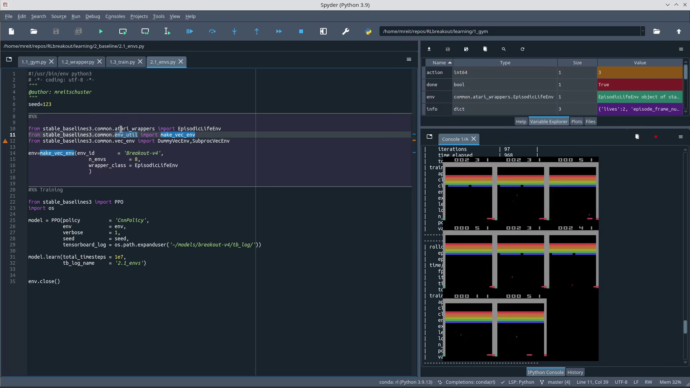

# TLDR

[We already set up](../1_gym) Gym and stable_baselines3 to work in a conda environment with pytorch and tensorboard. We were able to train a PPO model to play breakout. But it doesnt play good. So now we improve the speed at which we train, evaluate the average score and reproduce a well-perfoming model. This will be our *baseline* against which we measure further improvements.

**Train RL model to play Breakout - Howto 2/5** Video link - click on the picture.
[](https://youtu.be/RKd13RGI1Yg)

# [2.1_envs.py](./2.1_envs.py)
We can use multiple environments at the same time to train in parallel. I removed the piece of code rendering a game, as going forward we rely on tensorboard to evaulte performance. If you want to have a video check in [../video](../video) where I keep the codesnippets to create the videos and gifs.

For me I felt RAM is the restriction and 12 or more environments would make my system unstable, killing the konsole from which i started the tools and sometimes even logging me out. So I went to 8 envs, which already provides much better scores. Instead of an average of 1 reward per game - 1 block hit before dropping the ball - we get about 5 per game. With a promising trajectory on tensorboard implying higher scores when we train longer - running the training for 1e6 steps shows this levels out at a score of 8.

Better. Not great.


# [2.2_callbacks.py](./2.2_callbacks.py)

## Eval Callback
We want to see evaluation metrics - i.e. using the trained model on a different environment (similar to evaluting on a seperate set of test data in non RL). It is necessary that the evaluation environment has the same structure - the same observation_space and action_space, so we need to apply the same wrappers.

Now in the model.learn step gym automatically wraps the (training-)env in a monitor and a VecTransposeImage wrapper. But the eval callback doesn't. After VecTransposeImage the dimensions of the observation space are reordered, so eval_env and env will have different shapes.
```UserWarning: Training and eval env are not of the same type```

So we wrap both manually in VecTransposeImage now. To avoid duplication I wrote a function to create the environment(s). Consider if you want the model to behave deterministically in the eval environment. That means it would always take the action that has the highest probable reward. In my case it made the game stuck (either not starting or being stuck in a position where the ball would just bounce back and forth).

I had issues getting **RuntimeError: Tried to step environment that needs reset** error when I used the EpisodicLifeEnv wrapper in the eval environment at later codesets. So in later codebases I ended up disabling this wrapper in eval environments, while keeping it on in the training environments.


## Record own metrics
In [zoo's enjoy.py](https://github.com/DLR-RM/rl-baselines3-zoo/blob/master/enjoy.py#L179) it states that atari rewards are not necessarily the same as in-game scores. But a [random post on stackoverflow](https://stackoverflow.com/questions/58678710/atari-score-vs-reward-in-rllib-dqn-implementation) states for Breakout it is the same. So let's check that. And then we find that the
```
_,_,_, infos = env.step(action)
episode_infos = infos[0].get("episode")
episode_infos
```
episode_infos being None. So there (in breakout) is no such variable available. So we add another callback that calculates the cumulated rewards and writes it out to our tensorboard. The numbers are consitent with the numbers already written out by default - especially in the beginning of a training when the difference in methodology doesnt have a strong effect. So let us stick with the default mean reward.

# [2.3_copying_hp_zoo.py](./2.3_copying_hp_zoo.py)

## baseline zoo
Our aim here is to understand and reproduce a well-performing example from [stable-baselines3-zoo](https://github.com/DLR-RM/rl-baselines3-zoo/). So we first downlaod it and run it, so we have results to compare. Be aware this takes a lot of time, as we aim to do 1e7 timesteps. For me it was half a day. Running with less timesteps will not provide same results as ctrl-c during training, due to the functional approach to learning rate and clipping. You can interupt it with ctrl+c - you will still have the best-model (until that step) and the beginning of the timeseries in tensorboard. So ensure you compare models with the same preselected number of timesteps. I went for 1e6.

```
sudo apt-get install swig cmake ffmpeg
git clone https://github.com/DLR-RM/rl-baselines3-zoo.git
cd rl-baselines3-zoo
pip install -r requirements.txt
python train.py --algo ppo --env Breakout-v4 -n 1000000 --seed 123 --tensorboard-log ~/models/breakout-v4/tb_log/zoo
```

To understand what the zoo does I used the debugger and walked through the code with it. I made some annotations in my code pointing to the corresponding lines in the zoo code. The code 2.3_copying_hp_zoo.py is intended to give you the same result as running zoo on breakout with PPO and all parameters as default.


## Hyperparameters
We havent done any hyperparameter tuning so far. But luckily we can just cheat and copy some known-to-work parameters from [stable-baselines3-zoo's PPO hyperparameters](https://github.com/DLR-RM/rl-baselines3-zoo/blob/master/hyperparams/ppo.yml).
```
atari:
  env_wrapper:
    - stable_baselines3.common.atari_wrappers.AtariWrapper
  frame_stack: 4
  policy: 'CnnPolicy'
  n_envs: 8
  n_steps: 128
  n_epochs: 4
  batch_size: 256
  n_timesteps: !!float 1e7
  learning_rate: lin_2.5e-4
  clip_range: lin_0.1
  vf_coef: 0.5
  ent_coef: 0.01
```

## Atari Wrapper
Zoo uses the [Atari wrapper](https://stable-baselines3.readthedocs.io/en/master/common/atari_wrappers.html), which includes the EpisodicLifeEnv wrapper we had already used. I recommend reading the docu to better understand its components:
```
AtariWrapper(env, noop_max=30, frame_skip=4, screen_size=84, terminal_on_life_loss=True, clip_reward=True)

ClipRewardEnv(env)
EpisodicLifeEnv(env)
FireResetEnv(env)
MaxAndSkipEnv(env, skip=4)
NoopResetEnv(env, noop_max=30)
WarpFrame(env, width=84, height=84)
```
For our learning curve an in depth knowledge is not required.

## Framestack
As the [stable baselines3 docu](https://sb3-contrib.readthedocs.io/en/master/modules/ppo_recurrent.html) mentions there is a recurrent PPO, but using PPO on top of a framestacked environment performs similarly. Both take into account the past frames, which is necessary to allow the model to determine velocity and direction of the ball.

You can find the details in the [VecFrameStack's source](https://stable-baselines3.readthedocs.io/en/master/_modules/stable_baselines3/common/vec_env/vec_frame_stack.html#VecFrameStack)

## linear_schedule
Learning rate and clip rate are defined as functions, not numbers. Both scale linearly down to 0 at the last timestep. This can be observed in tensorboard.


