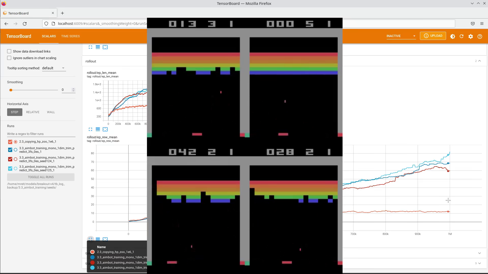
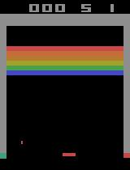
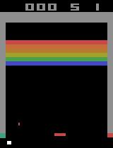
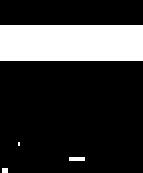
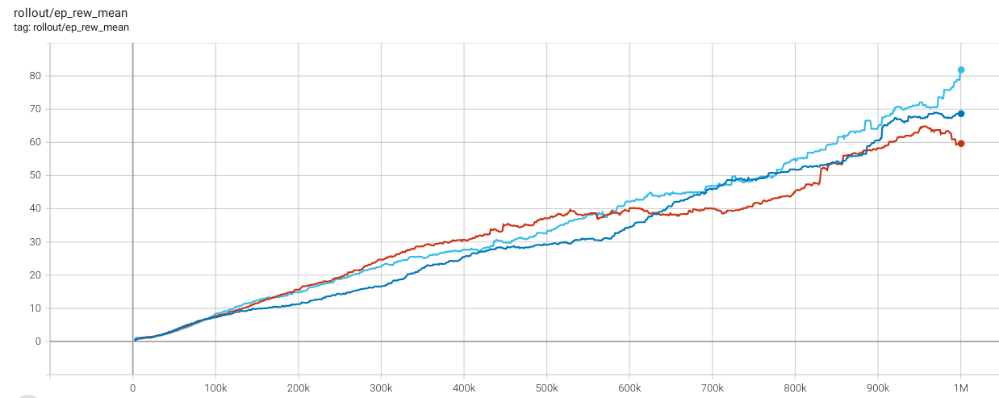

# TLDR

[We already set up](../2_baseline) a baseline model which scores 8-12. Our goal now is to improve the model to beat the game consistently by adding an observation wrapper that serves as an aimbot and some manual hyperparameter tuning.

With this we manage to score around 200-400 per game.

**Train RL model to play Breakout - Howto 3/5** Video link - click on the picture.

# [3.1_observation_space.py](./3.1_observation_space.py)
Our model gets the image from the game as observation_space - without wrappers it sees what a human sees. On the left we see the observation after the Atari wrapper - a downsampled, grey image. On the right we see the original image. When using env.render() we get the original image, because the wrapper hasn't implemented a render() function, so it falls back to the original environment. The code runs until a hardcoded frame, which I selected such that we see the ball close to the pedal, and then exports both image and observation as csv and jpeg.

&nbsp;&nbsp;&nbsp;

So this looks smart - smaller input into our model: 84x84x1 instead of 210x160x3, without losing anything we deem necessary for gameplay. We have a look at the arrays in the region of the pad and ball. It is the same frame as above, just zoomed in.

&nbsp;&nbsp;&nbsp;

In the arrays we see that the downsampling *smears* the ball a bit. On the original array (right) I only show one colour channel. The others look the same. We see clear cut 200 and 0 values, while on the state after the wrapper we see values in between. And the ball doesnt even look like being a single piece but rather being falling apart into two pieces.

# [3.2_observation_wrapper.py](./3.2_observation_wrapper.py)
In this code we add an observation wrapper that trims the picture to the game area and greyscales/monochromes it, but in contrast to the stabel-baselines3's Atari Wrapper we keep the pixels 1:1 and don't downsample the image. For that we investigate the array picture and note down the geometric layout in variables, which we hardcode in the init of the wrapper.

## Monoscale and Trim
The trimming uses the hardcoded geometric parameters to cut away the sides and top. The monoscale projects everthing to white and black.  

&nbsp;&nbsp;&nbsp;

## Aimbot
Let's build an aimbot - a simple one, that only predicts a straight line. So it can only make a prediction, if the ball travels downwards and is already at a height, where no obstacles can be, so below the area where the bricks are.

&nbsp;&nbsp;&nbsp;

This time both pictures are after the wrapper - otherwise we couldn't see the aimbot's prediciton. The left is when we leave it 3 coloured and don't trim, the right picture is with removing border info and colours being mono. You see the prediciton as a dot in the left lower corners. In the video I explain the idea how the code deals with the bouncing of the ball at the walls.

I had some issues with unexpected results and suspected the hyperparameters being connected to the picture dimensions - especially the size of the kernel in the convolutional layers.
- I had experimented with trimming the observation space as well as overwriting the border regions with black or white.
- I experiemented with the number of colour channels (flag_col 'grey_3dim' or 'grey_1dim') - using a single channel should be enough for greyscale & mono, but it changes the third dimension. It seemed to me that framestack (from wrapper VecFrameStack) and frameskip (used in 3.4 and 2.3 from AtariWrapper and MaxAndSkipEnv) use the same dimension in the observation space array, so we needto be careful about the order in which we apply the wrappers.
- Another suspect was EpisodicLifeEnv() not behaving as expected if it doesnt get the orignal observation_space, so it went before applying the custom wrapper.

# [3.3_aimbot_training.py](./3.3_aimbot_training.py)

The previous code helped by visualizing the model. Now it is time to train the model and see how well it can perform with the different combinations of wrappers and flags. In addition to the previous step there is the wrapper_class_generator() that creates and hands over the combined wrapper, as make_vec_env() expects a function that takes no arguments, but we added flags to fine-tune the wrapper.

Ultimately I chose a framsetack of 3, trimming and monosclaing of the observation space and aimbot turned on. The tensorboard shows different training sessions of the same parameters with different seeds. This shows us that we need to expect quite some variation in the results.

We also explore the option of encoding individual variables into the picture as individual pixels:
- time to impact
- predicted impact column
- ball's row and column
- padel's column
This did not enchance the model's performance and I suspect even thought providing this data to the model make sense, more time is needed to properly explore how to combine spatial with non-spatial information.

# Remarks
I recommend to have a look at [Nicholas Renotte's Video Build a Street Fighter AI Model with Python](https://www.youtube.com/watch?v=rzbFhu6So5U) with its [code hosted also on github](https://github.com/nicknochnack/StreetFighterRL/blob/main/StreetFighter-Tutorial.ipynb). I find noteworthy, that he defines observation space as the difference in pixels from one frame to another.
