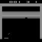

# TLDR

[We already set up](../2_baseline) a baseline model which performs better than me. Our goal now is to improve the model to beat the game consistently.

# [3.1_observation_space.py](./3.1_observation_space.py)
Our model gets the image from the game as observation_space - it sees what a human sees. On the left we see the state after the Atari wrapper - a downsampled, grey image.
On the right we see the original image. When using env.render() we get the original image, I suspect this is because the wrapper hasn't implemented a render() function, so it falls back to the original environment.

So this looks smart - smaller input into our model 84x84x1 instead of 210x160x3, without losing anything we deem necessary for gameplay. We have a look at the arrays in the region of the pad and ball. It is the same frame as above.

In the arrays we see that the downsampling *smears* the ball a bit. On the original array (right) I only show one colour channel. The others look the same. We see clear cut 200 and 0 values, while on the state after the wrapper we see values in between. And the ball doesnt even look like being a single piece but rather being falling apart into two pieces.

# [3.2_observation_wrapper.py](./3.2_observation_wrapper.py)
In this code we add an observation wrapper that trims the picture to the game area and greyscales/monochromes it, but in contrast to the stabel-baselines3's Atari Wrapper we keep the pixels 1:1 and don't downsample the image. For that we investigate the array picture and note down the boundaries in variables, which we hardcode in the init of the wrapper.

# [3.3_aimbot.py](./3.3_aimbot.py)
Let's build an aimbot - a simple one, that only predicts a straight line. So it can only make a prediction, if the ball travels downwards and is already at a height, where no obstacles can be.

This time both pictures are after the wrapper - otherwise we couldn't see the prediction. The left is when we leave it 3 coloured and don't trim, the right picture is with trimming and mono.

# [3.4_training_aimbot.py](./3.4_training_aimbot.py)

The previous code helped by visualizing the model. Now it is time to train the model and see how well it can perform with the different combinations of wrappers and flags.

