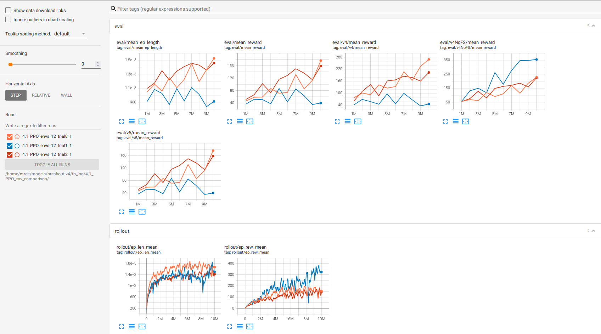

# TLDR

With some tuning of the environment variables we now achieve scores well above 400. The price is that the model doesn't generalize any more and cannot cope with slight stochastic elements in the environment.

**Train RL model to play Breakout - Howto 4/5** Video link - click on the picture.
[](https://youtu.be/gzjdqqmWqNI)


# Setup
Make sure you have optuna installed:
```
conda install optuna
```
in case you use anaconda. Make sure you execute it in the correct environment.

# [4.0_wrapperOptuna_PPO.py](./4.0_wrapperOptuna_PPO.py)
This code first creates the optuna study *study1* runs it for a few hours (1e6 steps per trial) and then picks the 5 best performing trials and put these in study2, which has a longer training time (1e7).

# [study_explore.py](./study_explore.py)
This is a script that collects a few lines that allow us to explore the feature importance derived from the tuning results. Optuina by default ignores pruned trials for feature importance. A function has been added to copy the study, set pruned trials to status COMPLETE and give them a score of 0. This can be understood as an imputation of missing values.


# deterministic environment & stochasticity injection


This is a impressive gameplay we get out of the tuned model. But it all looks so similar. The reason is that the tuning algo chose 'BreakoutNoFrameskip-v4' as environment, which has no stachastic elements. The game always behaves exactly the same way, given the same previous state and model action. The only reason it tends to get out of sync, is because we added `deterministic=False` to the model prediction function, so sometimes the model might chose a different action.

## Not overfitting, but memorizing sequences


And this is the same model - the ones that performed way beyond 400 above - playing 'Breakout-v5', an environment with sticky buttons. As soon as something not per playbook happens it fails. If we want to avoid this we need to train on an environment with some randomness.


## Training on stochastic environment
In a stochastic environment, that deviates (very little) at some points, our model performs very badly. It cannot cope with even slight changes. Such stochastic elements can be:
- Frameskip, sometimes a frame is skipped at random (or out of N consecutive frames 1 is randomly chosen to be shown)
- Random Action or Sticky button, sometimes instead of doing what the model told it to the action taken is either random or the same as last
- Noop in beginning, the environment will at start progress a few steps without input of the model.

To dive a bit deeper, especially understanding the drawbacks of each of these methods, have a look at [Nicolas Maquaire's post on stochasticity mechanism](https://towardsdatascience.com/are-the-space-invaders-deterministic-or-stochastic-595a30becae2).


# Devil in the details

Be mindful what scores you are shown as reference. [SB3 zoo's benchmarks](https://github.com/DLR-RM/rl-baselines3-zoo/blob/master/benchmark.md) show scores of 398+-33 for Breakout with PPO after 1e7 steps. And also [Vincent Mueller's code](https://medium.com/towards-data-science/training-rl-agents-in-stable-baselines3-is-easy-9d01be04c9db) achieves extremely high scores for such straightforward code. Both are not using Frameskip or Sticky/Random Buttons.

I reran Vincent's code to train the model - A2C model on AtariWrapper, 1e7 steps on 'BreakoutNoFrameskip-v4'.


On the deterministic environment 'NoFrameskip-v4' it is not in sync (even if we turn of deterministic model predictions). The reason is in the [Atarwrapper's Noop](https://stable-baselines3.readthedocs.io/en/master/_modules/stable_baselines3/common/atari_wrappers.html#NoopResetEnv)  - it adds some randomness by adding a random number of noops in the beginning of the game (up to 30), so the model cannot memorize a perfect sequences.


But applying the model to v5, we see it performing poorly on the stochastic environment. My guess is that the model just memorizes 30 different sequences.

# More Devils - differences in environments
## [4.1_PPO_env_comparison](https://github.com/mreitschuster/RLbreakout/blob/master/learning/4_tuning/4.1_PPO_env_comparison.py)

hh0rva1h has [pointed out in a discussion](https://github.com/mreitschuster/RLbreakout/issues/1) that besides the stochasticity/determinism there are more differences between the environments that likely have an effect on how models perform on each others environments. The action space is different bertween v4 and v5 and there are determinstic frameskips on the wrapper and environment side. Of course this can be [found in Gym's docu](https://www.gymlibrary.ml/environments/atari/#version-history-and-naming-schemes). So I fixed the code to adjust for those differences. But the main conclusions stay the same.

**Training on a stochastic environment trains slower, but generalizes better to other environments. But trained on NoFrameskip-v4 - a purely deterministic environment trains fast, but transfers poorly to a stochastic environment.**


Orange line is the model trained on v4, Blue on NoFrameskip-v4 and Red on v5. In the eval section we see 3 new graphs:

*eval/v4/mean_reward*

*eval/v4NoFS/mean_reward*

*eval/v5/mean_reward*

They are individual eval callback for each environments - we train a model once and let it run through all 3 callbacks. The callback had tro be modified to allow for arbitrary naming. We see that Blue performs better on NoFrameskip-v4, but worse on v4 and v5.


# [4.2_PPO_tuning_grid_define_study](https://github.com/mreitschuster/RLbreakout/blob/master/learning/4_tuning/4.2_PPO_tuning_grid_define_study.py)
In this code pieces finally dive into some hyperparameter tuning - espcially into the effects of batch_size, n_epochs and n_steps.
[TrialEvalCallback.py](https://github.com/mreitschuster/RLbreakout/blob/master/learning/4_tuning/TrialEvalCallback.py) contains a modified version of evalCallback that allows us to track some more statistical measures in tensoboard - especially the median.


# [4.3_PPO_tuning_bestrun.py](https://github.com/mreitschuster/RLbreakout/blob/master/learning/4_tuning/4.3_PPO_tuning_bestrun.py)
in order to allow for longer running trainings we need to consider how to adapt the sheduler. We expect that when we train a model for a different number of timesteps, once with 1e6 and once with 1e7, all else being equal that on the way, at any step <1e6, both produce the same results. That is not true for linear shedules. They are not scale-invariant. So I introduced a exponential sheduler. The adapted objective function allows for the choice of sheduler to be a hyperparameter.
[create_objective_shedule.py](https://github.com/mreitschuster/RLbreakout/blob/master/learning/4_tuning/create_objective_shedule.py)
