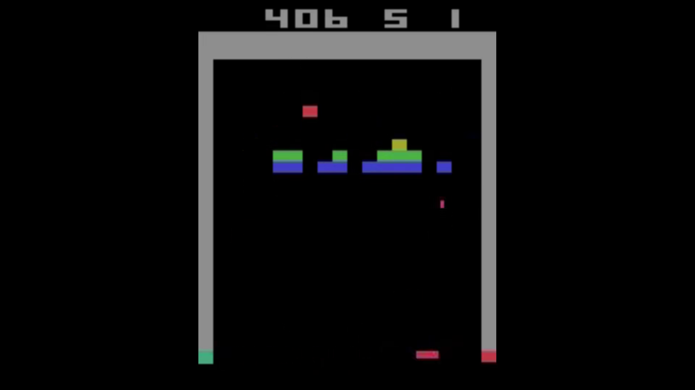

# TLDR

With some tuning of the environment variables we now achieve scores well above 400. The price is that the model doesn't generalize any more and cannot cope with slight stochastic elements in the environment.

**Train RL model to play Breakout - Howto 4/5** Video link - click on the picture.
[](https://youtu.be/vdtOBbPTGwk)


# Setup
Make sure you have optuna installed:
```
conda install optuna
```
in case you use anaconda. Make sure you execute it in the correct environment.

# [4.0_wrapperOptuna_PPO.py](./4.0_wrapperOptuna_PPO.py)
This code first creates the optuna study *study1* runs it for a few hours (1e6 steps per trial) and then picks the 5 best performing trials and put these in study2, which has a longer traning time (1e7).

# [study_explore.py](./study_explore.py)
This is a script that collects a few lines that allow us to explore the feature importance derived from the tuning results. Optuina by default ignores pruned trials for feature importance. A function has been added to copy the study, set pruned trials to status COMPLETE and give them a score of 0. This can be understood as an imputation of missing values.


# deterministic environment & stochasticity injection


This is a impressive gameplay we get out of the tuned model. But it all looks so similar. The reason is that the tuning algo chose 'BreakoutNoFrameskip-v4' as environment, which has no stachastic elements. The game always behaves exactly the same way, given the same previous state and model action. The only reason it tends to get out of sync, is because we added `deterministic=False` to the model prediction function, so sometimes the model might chose a different action.

## Not overfitting, but memorizing sequences


And this is the same model - the ones that performed way beyond 400 above - playing 'Breakout-v5', an environment with sticky buttons. As soon as something not per playbook happens it fails. If we want to avoid this we need to train on an environment with some randomness.


## Training on stochastic environment
In a stochastic environment, that deviates (very little) at some points, our model performs very badly. It cannot cope with even slight changes. Such stochastic elements can be:
- Frameskip, sometimes a frame is skipped at random (or out of N consequtive frames 1 is randomly chosen to be shown)
- Random Action or Sticky button, sometimes instead of doing what the model told it to the action taken is either random or the same as last
- Noop in beginning, the environment will at start progress a few steps without input of the model.

To dive a bit deeper, especially understanding the drawbacks of each of these methods, have a look at [Nicolas Maquaire's post on stochasticity mechanism](https://towardsdatascience.com/are-the-space-invaders-deterministic-or-stochastic-595a30becae2).


# Devil in the details

Be mindful what scores you are shown as reference. [SB3 zoo's benchmarks](https://github.com/DLR-RM/rl-baselines3-zoo/blob/master/benchmark.md) show scores of 398+-33 for Breakout with PPO after 1e7 steps. And also [Vincent Mueller's code](https://medium.com/towards-data-science/training-rl-agents-in-stable-baselines3-is-easy-9d01be04c9db) achieves extremly high scores for such straightforward code. Both are not using Framskip or Sticky/Random Buttons.

I reran Vincent's code to train the model (1e7 steps on 'BreakoutNoFrameskip-v4') and then let it play on 'Breakout-v5'


On the determinstic environment 'NoFrameskip-v4' it is not in sync (even if we turn of deterministic mofel predictions). The reason is in the [Atarwrapper's Noop](https://stable-baselines3.readthedocs.io/en/master/_modules/stable_baselines3/common/atari_wrappers.html#NoopResetEnv)  - it adds some randomness by adding a random number of noops in the beginning of the game (up to 30), so the model cannot memorize a perfect sequences.


But applying the model to v5, we see it performing poorly on the stochastic environment. My guess is that the model just memorizes 30 different sequences.

4.1
pip install sb3-contrib
