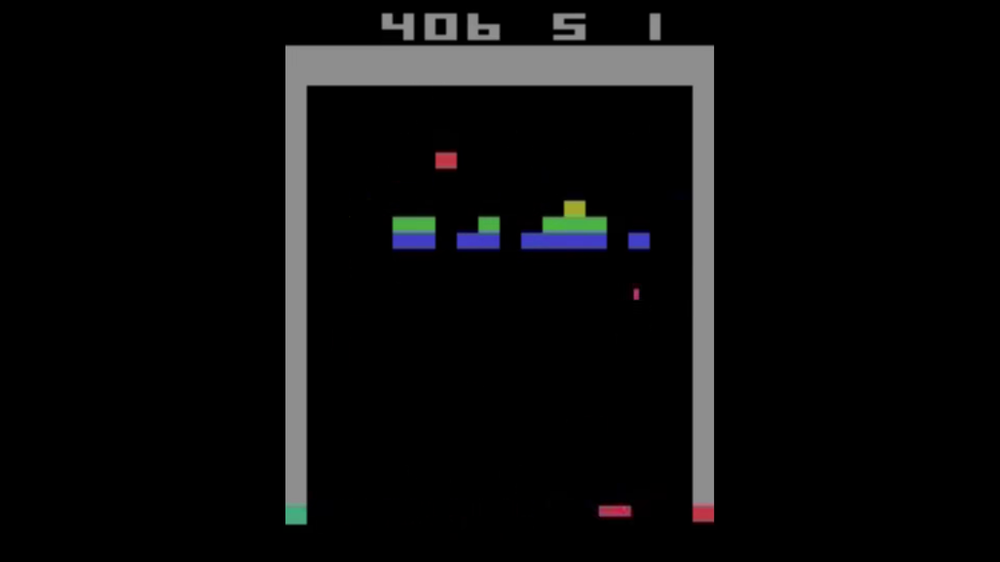

# TLDR
We now have our final model trained on a stochastic environment and scoring well around 350

The last video tackles the hyperparameter tuning as well as adapting the shedulers.

**Train RL model to play Breakout - Howto 5/5** Video link - click on the picture.

# [5.1_baseline_v5.py](./5.1_baseline_v5.py)
This code recreates the baselines we already had in chapter 2 and 3 for more trianing steps.

# [5.1_PPO_summary.py](./5.1_PPO_summary.py)
Here we run the optimal hyperparameter determined in [4_tuning](../4_tuning) for a longer training period.

