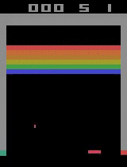

# RLbreakout

This learning path is intended to help you understand bit by bit - assuming you have some python skills and have played a bit with machine learning models in the past, I believe this is a gentle introduction into reinforcment learning. I tried to focus on simplicity, adding concepts step by step.

# [0_setup](./0_setup)
In my own beginning I started using jupyter notebook, but then switched to a spyder environment, as for me debugging was easier - especially for working through the [stable-baselines3-zoo codebase](https://github.com/DLR-RM/stable-baselines3).

# [1_gym](./1_gym)
This is the very basic setup - getting a gym environment to run and train our very first, but not very effective model. More about ensuring we have everything we need - especially a basic understanding of how we can train a model to play the game and see its in- and outputs. Consider watching the [video highlighting the main steps and thoughts](https://youtu.be/DqzSCpKE-zk) (10 min).

# [2_baselines](./2_baselines)
We understand how [stable-baselines3-zoo](https://stable-baselines3.readthedocs.io/en/master/guide/rl_zoo.html) trains a model for Breakout and reproduce its results with simplified code (for the specific case of PPO on Atari breakout). These are the steps taken:
- use multiple environments in parallel
- add an evalution callback to evaluate our model in a different environment
- add a custom callback to write custom metrics into tensorboard
- run the zoo code
- using hyperparameters from zoo in our model
- use linear shedules to decrease clip_range and learning_rate during trianing
- use framestack wrapper to allow the model to determine velocity and direction of the ball
- use [AtariWrapper](https://stable-baselines3.readthedocs.io/en/master/common/atari_wrappers.html) to make the observation space more accessible to our model

The resulting model is at the level of a human beginner - score average around 12 (per game, so for all 5 lives).
Consider watching the [video highlighting the main steps and thoughts](https://youtu.be/RKd13RGI1Yg) (20min).

# [3_obswrapper](./3_obswrapper)
First we look into how the observation space is shaped by wrappers in the zoo code, understanding how the dimensions link to colour channels and framestack. We export the image - how it is rendered to a human, as well as the observation - after applying wrappers - to jpeg and csv. This informs our choice on which wrappers to use.
We add an observation wrapper that removes colour information, trims the picture and adds an Aimbot - additional visual information about where the ball will cut the padel's pane. We then manually tune the framestack hyperparameter and see how the different features of the observation wrapper perform.

We then write a wrapper that monscales and trim the observations space. And it addsa an Aimbot - a prediction to where the ball with cut the padel's pane. Trying to encod the variables time to impact, predicted impact point, ball's position and padel's poisiton as individual pixels did not perform as hoped for. Likely a more clever way to provide spatial (image) and non-spatial (coordinates) information in observation space would be needed. Some variants of this wrapper together with the number of stacked frames are evaluated against each other on tensorboard.

This gets us to a model that gets average rewards of 60-80 per game when trained for 1e6 steps and 200-400 per game when trained with 1e7 timesteps (7 hours on my pc).
Consider watching the [video highlighting the main steps and thoughts](https://youtu.be/luRhvvOgEYk) (25min).

# [4_tuning](./4_tuning)
We explore ways to use [Optuna](https://optuna.readthedocs.io/en/stable/) to tune hyperparameters, looking at the interaction of the optuna objective, trial, sampler and pruner.

Both instances are played by the same model - in different environments. The model was trained in BreakoutNoFrameskip-v4. The left is from it playing in the same. On the right we see it performing in Breakout-v5, which has some stochastic elements. The model has memorized the exact steps to get a great score. But as soon as the environment behaves slightly differently it cannot cope.

# TODO

resampling late-game states
noise for exploration
other models
on policy/off policy

# Remarks
I recommend to have a look at [Nicholas Renotte's Video Build a Street Fighter AI Model with Python](https://www.youtube.com/watch?v=rzbFhu6So5U) with its [code hosted also on github](https://github.com/nicknochnack/StreetFighterRL/blob/main/StreetFighter-Tutorial.ipynb). I find noteworthy, that he defines observation space as the difference in pixels from one frame to another.
